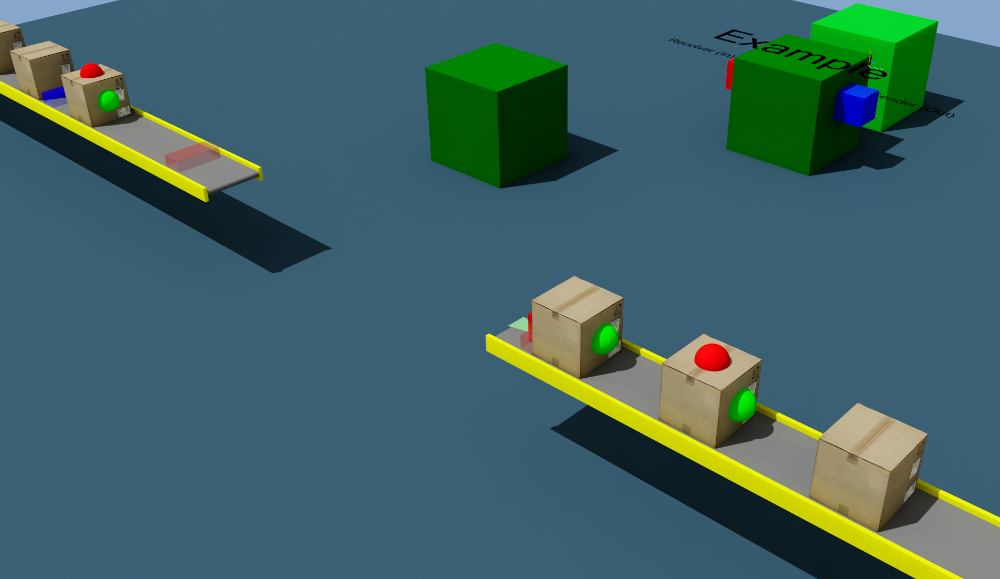

# Positions and Dimensions
|||
|-|-|
|**Emulate3D Version**|18.00.02|
|**Tutorial Link**|[MultiModel](https://store.sim3d.com/demo3d_2025/multimodel)|

## Description
An example which transfers a load from one conveyor to another conveyor, via MultiModel, whilst keeping the components of the load intact. To keep the example simple, both the sender and receiver are defined in a single model.

### Components model
The `ComponentAdder` Visual has a script, `AddComponentAspect`, which has a random chance of enabling the `HasC1` and `HasC2` properties on the blocking load. The load has a script, `CardboardBoxWithComponentScript`, which listens for changes to those properties and updates the visiblity of the components based on the value.  
These properties are also set when the load is received by the `MultiModelSenderReceiverAspect` on the `Receiver` Visual. 

The loads are created with the components already created, but hidden, for improved performance. You could also dynamically add them for more control.  
The loads also already have the `HasC1` and `HasC2` custom properties defined. These are also declared in the `MultiModelSenderReceiverAspect.TransmittedProperties` property found on the `Sender` Visual.

### Components Catalog
The components catalog contains the load that is used in the model and the two example component visuals.

## Usage
- Select the MultiModel Server visual
- Open the Aspect Viewer and click the `Open Dashboard` button under the `Multi Model Server` aspect.
- Click `Run Model` in the Dashboard.

Loads will be transferred from one conveyor to another via the MultiModel connection.

