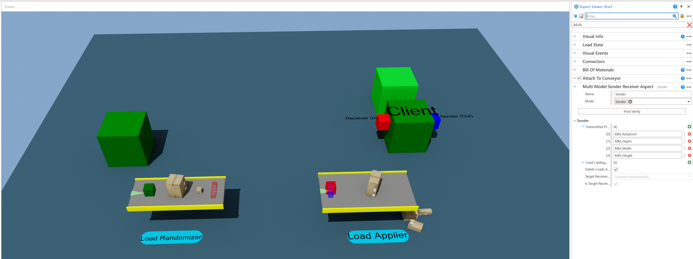

# Positions and Dimensions
|||
|-|-|
|**Emulate3D Version**|18.00.01|
|**Tutorial Link**|[MultiModel](https://store.sim3d.com/demo3d_2025/multimodel)|

## Description
A simple example which transfers the load from one conveyor to another conveyor, via MultiModel, whilst keeping both the orientation and dimensions of the transferred load.

For simplicity, both the MultiModel server and client are within the same model. The client sends loads to itself via two `MultiModel Sender Receiver` aspects, one in **Sender** mode and one in **Receiver** mode. 

Both the dimension and position values are sent as custom properties on the load, and these properties have been declared on the Sender aspect's `Transmitted Properties` property.

There are two custom aspects in the model, `Load Randomizer Aspect` and `Load Applier Aspect`.
### Load Randomizer Aspect
This aspest listens for the load creation, applies random values to the dimensions and orientation of the load and also adds them as custom properties to the load.

### Load Applier Aspect
This aspect listens for loads that have been received via MultiModel, reads the values of the custom properties and applies them to the load. 

## Usage
- Select the MultiModel Server visual
- Open the Aspect Viewer and click the `Open Dashboard` button under the `Multi Model Server` aspect.
- Click `Run Model` in the Dashboard.

Loads will be transferred from one conveyor to another via the MultiModel connection.

