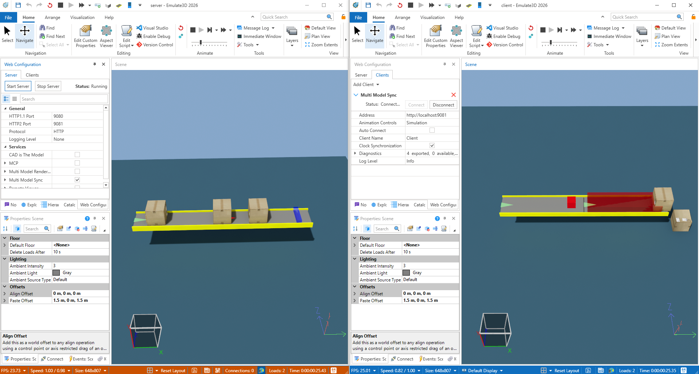

# Simple Sensor Multi Model Example
|||
|-|-|
|**Emulate3D Version**|19.00.00|
|**Tutorial Link**|[Multi Model](https://store.sim3d.com/demo3d_2026/multimodel)|

## Description
An example demonstrating Multi Model communication between two models — a [Server](server.demo3dx/Model.demo3dx) and a [Client](client.demo3dx/Model.demo3dx). The Server Model sends loads to the Client Model, and the Client Model sends sensor feedback back to the Server to control conveyor operation.

Both models share a [LoadCreatorDeleter](server.demo3dx/scripts/LoadCreatorDeleter) script project containing:
- [LoadDeleter](server.demo3dx/scripts/LoadCreatorDeleter/LoadDeleter.cs) — Deletes a load and publishes its description as a `TemporaryPropertyValue<LoadDescription>`.
- [LoadCreator](client.demo3dx/scripts/LoadCreatorDeleter/LoadCreator.cs) — Listens for a `LoadDescription` and re-creates the load at the corresponding position.
- [LoadDescription](server.demo3dx/scripts/LoadCreatorDeleter/LoadDescription.cs) — A simple data class holding the load's name and positional offset.

### Server Model
The Server Model contains a conveyor that moves loads into a `LoadDeleter`. When a load reaches the deleter, it is removed from the Server and its description (name and offset) is published via a `TemporaryPropertyValue<LoadDescription>`. This value is shared across models so the Client can recreate the load.

The Server also has a [PhotoEyeReceiverAspect](server.demo3dx/scripts/PhotoEyeReceiverAspect.cs) that listens for a `Blocked` boolean property sent from the Client. When `Blocked` becomes `true`, the aspect turns the Server's conveyor motor off. When `Blocked` becomes `false`, the motor is turned back on.

### Client Model
The Client Model contains a `LoadCreator` that subscribes to the `LoadDescription` property. When a new description arrives from the Server, the [LoadCreator](client.demo3dx/scripts/LoadCreatorDeleter/LoadCreator.cs) creates the load at the appropriate position.

The Client also has a [MultiModelPhotoEyeAspect](client.demo3dx/scripts/MultiModelPhotoEyeAspect.cs) attached to a sensor. When a load blocks the sensor, the aspect sets the exported `Blocked` property to `true`. When the load clears the sensor, `Blocked` is set back to `false`. This boolean is shared back to the Server Model via Multi Model property binding.

## Usage
- Open both the [Server Model](server.demo3dx/Model.demo3dx) and the [Client Model](client.demo3dx/Model.demo3dx).
- In the Server Model, open the Web Configuration window and start the server.
- In the Client Model, open the Web Configuration window and connect to the server using the appropriate IP address and port.
- Run the simulation in either model.
- Observe loads traveling along the Server's conveyor, being deleted, and reappearing in the Client Model.
- When a load blocks the Client's sensor, the Server's conveyor stops.
- When the sensor is cleared, the conveyor resumes.

