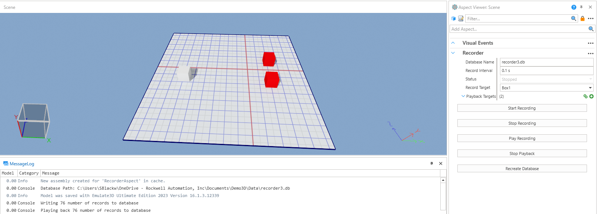

# EFCore_Database
|||
|-|-|
|**Emulate3D Version**|18.0.1|
|**Tutorial Link**|[Access External SQL Databases](https://store.sim3d.com/demo3d_2025/access_external_sql_databases)|
|||

## Description
An example model demonstrating how to connect to an external database using Microsoft's [Entity Framework Core](https://learn.microsoft.com/en-us/ef/core/) (EFCore).

In this model, the movements of the white box are recorded to an SQLite database. The movements can then be applied to the red boxes.

## Usage
- Open the Aspect Viewer.
- Click the `Start Recording` button on the `Recorder Aspect`.
- Move the white box.
- Click the `Stop Recording` button on the `Recorder Aspect`.
- Click the `Play Recording` button on the `Recorder Aspect`.

The red boxes will now replay the movement that was applied to the white box.

