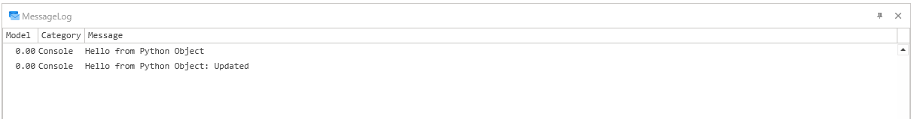

# Python Example
|||
|-|-|
|**Emulate3D Version**|18.00.01|
|**Tutorial Link**|N/A|
|||

## Description
An example model which uses the [python](https://www.nuget.org/packages/python) and [pythonnet](https://github.com/pythonnet/pythonnet) NuGet packages to execute and retrieve data from Python scripts.

The `PythonExample.OnReset` method initializes the Python environment and executes methods within the `getpyobject.py` Python script. These methods consist of getting a string, updating a string and getting the new value of the string.

## Usage
- Open the Test Runner.
- Navigate to the Scripted Scenarios tab.
- Run the test.

The values retrieved from the Python script are printed to the message log.

