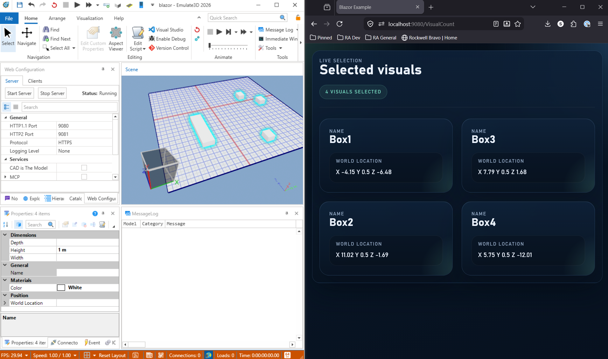

# Blazor Web Service Example
|||
|-|-|
|**Emulate3D Version**|19.00.00|
|**Tutorial Link**|https://store.sim3d.com/demo3d_2026/web_configuration_server|

## Description
An example model demonstrating how to register a custom [Emulate3D Web Service](https://store.sim3d.com/demo3d_2026/web_configuration_server that hosts a [Blazor Service](https://learn.microsoft.com/en-us/aspnet/core/blazor/) application within Emulate3D.

The model consists of the following key scripts:

- **[MyService.cs](blazor.demo3dx/scripts/BoxScript/MyService.cs)** — Registers the web service using the `[Emulate3DWebService]` attribute. Configures Razor components with interactive server rendering, registers a `SelectedVisualService` singleton, serves static files from a `wwwroot` directory, and maps Razor component endpoints.
- **[SelectedVisualService.cs](blazor.demo3dx/scripts/BoxScript/SelectedVisualService.cs)** — A service that tracks the currently selected visuals in the scene by subscribing to `SelectionManager.SelectionChanged`. It also listens to each selected visual's `OnMoved` event so the UI updates in real time as visuals are repositioned.
- **[VisualCount.razor](blazor.demo3dx/scripts/BoxScript/Components/Pages/VisualCount.razor)** — A Blazor page that displays the names and world locations (X, Y, Z) of all currently selected visuals, updating live as the selection or positions change.
- **[AssemblyRemappingComponentActivator.cs](blazor.demo3dx/scripts/BoxScript/AssemblyRemappingComponentActivator.cs)** — A custom `IComponentActivator` that remaps Blazor component types from stale assemblies to the current assembly after recompilation, preventing dependency injection failures.

## Usage
- Open the model in Emulate3D.
- Open the Web Configuration pane.
- Start the server from the Web Configuration pane.
- Navigate to the `/VisualCount` page, eg https://localhost:9080/VisualCount.
- Select one or more visuals in the Emulate3D scene.
- Observe that the selected visuals' names and world locations are displayed in the browser and update in real time as visuals are moved or the selection changes.

