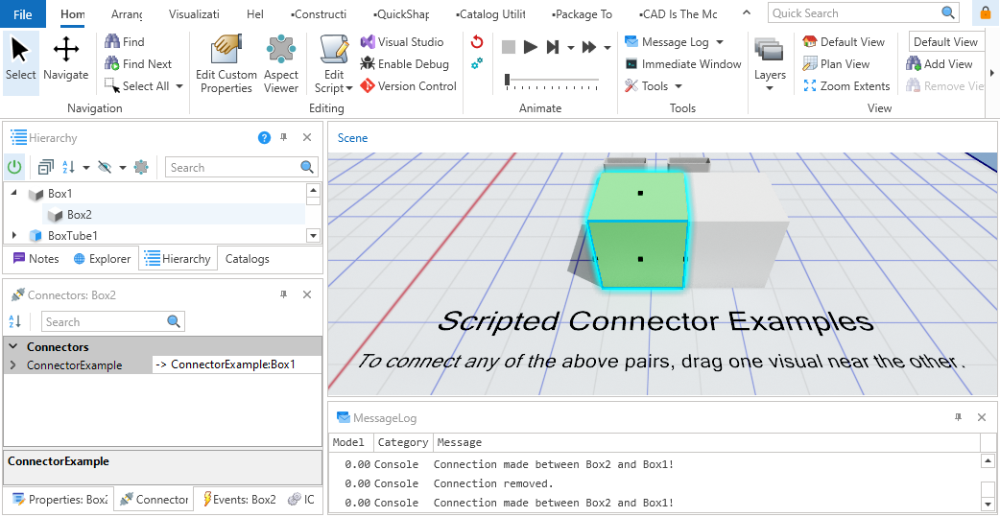

# Scripted Auto-Connecting Visuals Example
|||
|-|-|
|**Emulate3D Version**|18.00.01|
|**Tutorial Link**|N/A|
|||

## Description
The `ConnectorExample` script creates and manages a visual connector between simulation objects. This connector facilitates automatic snapping and alignment when objects are brought into proximity, enhancing modularity and interaction in simulation layouts.

Provided is an [example model](scriptedautoconnect_example.demo3dx/Model.demo3dx) containing visuals that showcase the [ConnectorExample](scriptedautoconnect_example.demo3dx/scripts/ConnectorExample.cs)  script capabilities.

## Usage
- Select any visual in the scene.
- Drag the visual close to its visual pair.
- Observe that the dragged visual turns green & that statemnts are printed to the **Message Log** when a connection is made/broken.