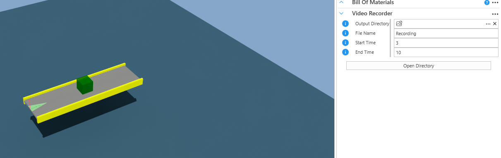

# Scripted Video Recording
|||
|-|-|
|**Emulate3D Version**|18.00.02|
|**Tutorial Link**|N/A|
|||

## Description
The `StraightBeltConveyor` has a `VideoRecorderAspect` which records video automatically using the defined start and end time. When the model reaches the end time, the video is saved to the Output directory with the define File Name.
The `VideoRecorderAspect` source is in the `VideoRecorderAspect.cs` script.

Clicking the Open Directory button on the `VideoRecorderAspect` will open the output directory, if it exists.

## Usage
- Open the Model.
- Select `StraightBeltConveyor1`.
- Open the Aspect Viewer.
- Edit the values of the `VideoRecorderAspect` as desired.
- Run the model for at least the amount of seconds that the End Time is defined as.

The video will be exported to the output directory.

