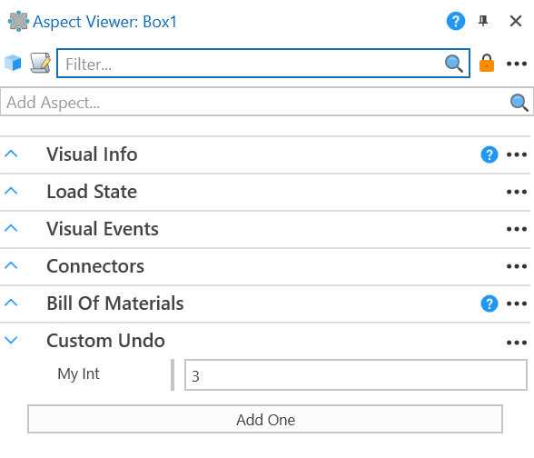

# Scripted Video Recording
|||
|-|-|
|**Emulate3D Version**|18.00.02|
|**Tutorial Link**|N/A|
|||

## Description
An example of how to implement an `IUndoableEdit` which allows custom undo/redo behaviours. In this example a custom edit has been defined to undo/redo the `Add One` action in the `CustomUndoAspect`.

### CustomUndoAspect
This class has a single int property, `MyInt` and an `Add One` method which adds one to `MyInt` and adds an edit to the documents `UndoManager` which allows the action to be undone.

### CustomEdit
This class is an example of how you can do custom undo/redo behaviour. It inherits from `DocumentVisualsEdit` as it has a helpful method to find the relevant visuals in the scene. It is important not to keep references to the visuals in and `IUndoableEdit` as the visuals may have been deleted/recreated when undoing/redoing.

## Usage
- Open the Model.
- Select `Box1`.
- Open the Aspect Viewer.
- Click the `Add One` button in the `Custom Undo` aspect.
- Click the Undo/Redo button to undo/redo the `Add One` action.