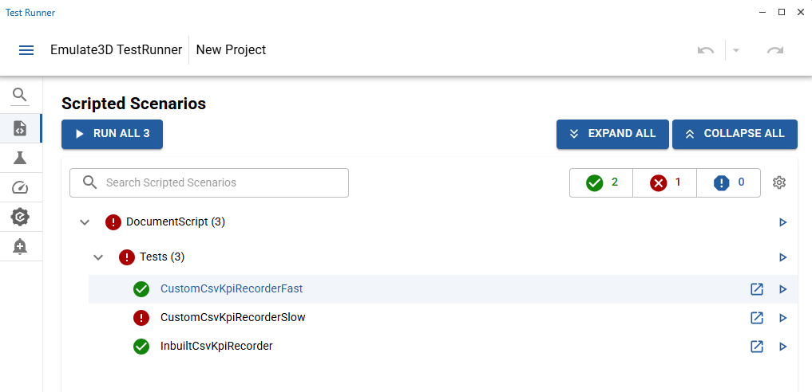

# KPI Recording
|||
|-|-|
|**Emulate3D Version**|18.00.02|
|**Tutorial Link**|N/A|

## Description
An example model showing how to use KPI recording with scripted scenarios.

The Scripted Scenarios in this example are found in `DocumentScript.cs`.

The `InbuiltCsvKpiRecorder` test uses the inbuilt `CsvKpiCollector` to output a results file to the model directory. `CsvKpiCollector` is the same KPI collector which is used when recording KPI's in Test Scenarios. The output of this test can be found in [Results_InbuiltCsvKpiRecorder.csv](kpi_recording.demo3dx/Results_InbuiltCsvKpiRecorder.csv)

The `CustomCsvKpiRecorderSlow` and `CustomCsvKpiRecorderFast` tests use a custom collector, `CustomCsvKpiCollector`, found in `CustomCsvKpiCollector.cs`. This collector records each KPI as a new row, using `KPI Name` and `KPI Value` columns. It has the cability to append to existing files, which can be useful when collecting data across multiple tests. It is a very basic implementation and is not compatible with primary keys. The output of this test can be found in [Results_Custom.csv](kpi_recording.demo3dx/Results_Custom.csv).

See [Scripted Scenarios](https://store.sim3d.com/demo3d_2025/test_runner_scripted_scenarios) for more information and [Scripted Scenario Example](https://store.sim3d.com/demo3d_2025/testrunner_scripted_scenario_example) for a step by step example of setting up a Scripted Scenario.

## Usage
- Open Test Runner wthin Emulate3D.
- Navigate to the Scripted Scenarios page.
- Click Run all.

