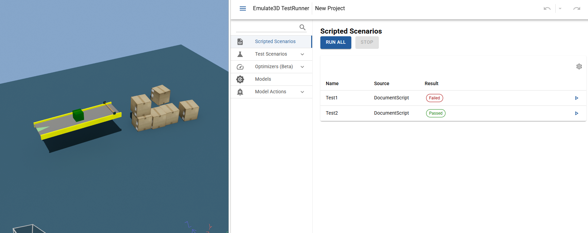

# Simple Example
|||
|-|-|
|**Emulate3D Version**|18.00.01|
|**Tutorial Link**|[Scripted Scenario Example](https://store.sim3d.com/demo3d_2025/testrunner_scripted_scenario_example)|

## Description
A simple example of two scripted scenarios.

The Scripted Scenarios in this example, found in `DocumentScript.cs`.

Both tests are testing that `PhotoEye1.BlockedCount` is greater than 20 after 40 seconds but they have different initial parameters.
`Test1` sets the conveyor speed to `0.5m/s` and is expected to fail.
`Test2` sets the conveyor speed to `5m/s` and is expected to pass.

See [Scripted Scenarios](https://store.sim3d.com/demo3d_2025/test_runner_scripted_scenarios) for more information and [Scripted Scenario Example](https://store.sim3d.com/demo3d_2025/testrunner_scripted_scenario_example) for a step by step example of setting up a Scripted Scenario.

## Usage
- Open Test Runner wthin Emulate3D.
- Navigate to the Scripted Scenarios page.
- Click Run all.

